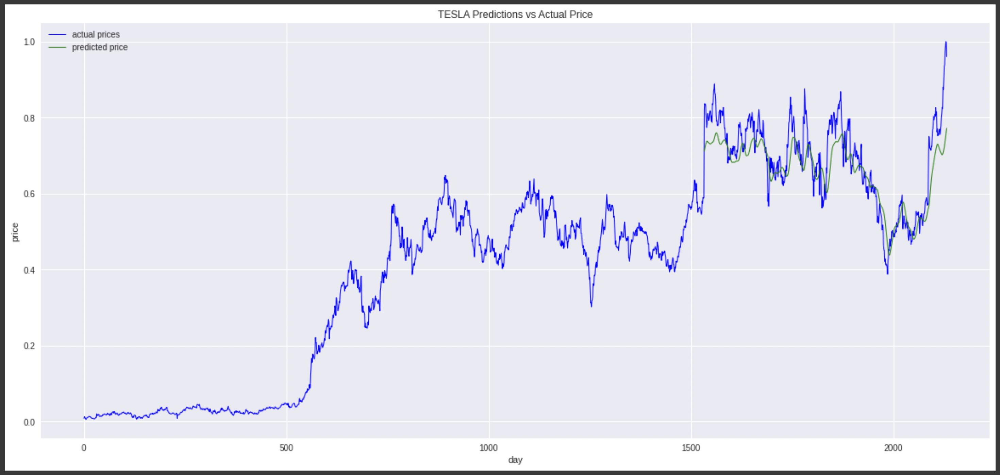

# FINANCIAL MODELING - THE METEORIC RISE OF TESLA (TSLA)

### Directory Structure:
```
master branch/ 
├── README.md 
├── diagrams/
	├── model.png
	├── model_summary.png
	├── dataset.png
	├── results.png
	├── results_zoomed.png
	├── feature_eng_g1.png
	├── feature_eng_g2.png
	└── feature_eng_g3.png
├── Proposal/ 
	├── Applied Data Analysis Project Proposal - Dhruv Srikanth.pdf 
	└── Applied Data Analysis Project Proposal - Dhruv Srikanth.pages 
├── Pitch/ 
	├── Financial Modeling Project Pitch - Dhruv Srikanth.pptx 
	└── Financial Modeling Project Pitch - Dhruv Srikanth.key 
├── Guidelines/ 
	└── Project Guidelines.pdf 
└── src/ 
	├── Create_Stocks_Dataset.ipynb 
	├── Create_and_Merge_Twitter_Dataset.ipynb 
	├── Feature_Engineering.ipynb 
	├── Model_Training_and_Evaluation.ipynb 
	├── weights/ 
		└── weights_best.hdf5 
	└── data/ 
		├── raw/ 
			├── TSLA_stock/ 
				└── TSLA.csv 
			└── Elon_Musk_tweets/ 
				├── 2010.csv 
				├── 2011.csv 
				├── 2012.csv 
				├── 2013.csv 
				├── 2014.csv 
				├── 2015.csv 
				├── 2016.csv 
				├── 2017.csv 
				├── 2018.csv 
				└── 2019.csv 
			└── processed_dataset/ 
				├── Bound_TSLA.csv 
				├── dataset_p1.csv 
				└── dataset_p2.csv
```

### Files and Folders:

- README.md - contains a walkthrough of the project given in this repository.
- Proposal folder - contains the project proposal submitted in pdf and pages format.
- Pitch folder - contains the project pitch submitted and presented in pdf and keynote format.
- Create_Stocks_Dataset.ipynb - notebook on time slicing done on the stock data.
- Create_and_Merge_Twitter_Dataset.ipynb - notebook to preprocess twitter data (clean and compute sentiment of tweets) and merge with stocks data.
- Feature_Engineering.ipynb - notebook to feature engineer columns in the dataset and explore trends between feature engineered vectors and stock information.
- Model_Training_and_Evaluation.ipynb - notebook to train and evaluate model (both quantitatively and qualitatively)
- TSLA_stock folder - contains TSLA stock data.
- Elon_Musk_tweets - contains Elon Musk's twitter activity.
- Bound_TSLA.csv - time sliced stock information.
- dataset_p1.csv  - merged twitter and stock information dataset.
- dataset_p2.csv - complete feature engineered dataset.
- weights/weights_best.hdf5 - contains the best performing models' weights.
- diagrams - All images found in this folder are used in the README and therefore, each diagram is associated with an appropriate description, when encountered in this file.

Note - If a file or folder is not listed above, it is because it is self explanatory from the directory structure provided above, and its file name.

### Data:
- TSLA_stock.csv and all files present in the Elon_Musk_tweets contain the stock information (by day) and Elon Musk's twitter activity for a period of 10 years, between 2010 and 2020. This is all raw data.
- Bound_TSLA.csv is a result of running the Create_Stocks_Dataset.ipynb notebook and contains the stock information restricted to a period of exactly 10 years.

- The dataset_p1.csv file is a result of the Create_and_Merge_Twitter_Dataset.ipynb notebook and contains the stock information for Tesla along with the sentiment information, grouped by day. If sentiment information was not available for a day, a linear interpolation is done to obtain this information. 

	Note - This is based on the assumptions that on any given day, it is highly probable that a person is feeling close to the same as he or she did on the previous day. 

- The dataset_p2.csv file is a result of the Feature_Engineering.ipynb notebook and contains the entire dataset complete with tweet information such as the sentiment, stock information such as the close price of TSLA for the day along with feature engineered information such as the relative strength index (RSI), moving average converge divergence (MACD) and momentum of the stock. 

	Note - This is the final dataset that will be used for training the model.

Here is a snapshot of final dataset - 


### Model:

An LSTM model is being used for this dataset. There is an input layer with 100 units, a hidden layer with 100 units, a hidden layer with 50 units and an output layer. Each LSTM layer is followed by a dropout layer with a value of 0.2, which helps to perform regularization and thereby reduce overfitting the model to the training data. Here, 0.2 indicates that 20% of the values will be randomluy sampled and dropped, thereby preventing the model from "over" learning the features of the training data.

A summary of the model can be seen below - 


Given below is the model architecture - 


### Feature Engineered Columns:
Features already present in the dataset were open price, day's high price, day's low price,  closing price, volume traded that day and the adjusted closing price.

In order to model the effect of the sentiment of the CEO, Elon Musk's tweets, I incorporated a sentiment score for each day. Apart from this, I computed the log of the return for each day. In addition, the relative strength index ([RSI](https://www.investopedia.com/terms/r/rsi.asp)) was used as a short term indicator, moving average convergence divergence ([MACD](https://www.investopedia.com/terms/m/macd.asp))	was used as a long term indicator and the intermediate momentum was computed to be a internmediate price indicator.

RSI = 100 − 100​/[1+(Average loss / Average gain)​]

I computed the averages over 14 days to keep the RSI as a short term indicator.

MACD = EMA (short period) - EMA (long period)

For these two periods, I have chosen 20 and 200 days respectively, in order to capture a trend over the long term.

Note - EMA = exponential moving average.

Finally, the intermediate momemtum was computed by calculating the moving average over a 60 day period.

Here is how the indicators look visualized (indicators on the y-axis and date on the x-axis) - 


As we can see in the above plot, the long and intermediate term indicators are follow a similar trend compared to the close price of the stock. The y-intercept of the indicators are far higher than that of the close price, as expected, since the indicators consider a longer time window in which the TSLA stock does exceptionally well.


It is difficult to notice a trend between the return of TSLA stock and the sentiment, in the above plot. I am hoping to see its helpfulness in the latent space.


The short term indicator (rsi) does provide some insights into the trend of the close price of TSLA stock, however, due to its short term nature, this is restricted to far smaller windows. In addition, we are able to see a correspondence between the return and the rsi. I am hoping that this will provide short term knowledge of the stock to my model.

### Training Configuration:
- Train-Test split = 70%-30%.
- Validation split on the training data is 35%.
- Sliding window over data = 100 days
- Epochs trained for = 20
- Batch size = 32

### Training Strategy:
- Optimizer - [Adam](https://arxiv.org/abs/1412.6980)
- Loss and metric - Root mean squared error ([RMSE](https://www.tensorflow.org/api_docs/python/tf/keras/metrics/RootMeanSquaredError))

### Results:
Evaluation was done using RMSE.
RMSE on the test set = 0.0651

In the plot below,  the ground truth close price of the stock over 10 years is provided, along with the predictions of the model on the test set - 


Given below is a magnified version of the same - 


### Takeaways:
The model performs quite well on its predictions. This is seen quantitatively, through the low RMSE and qualitatively, through the figures provided above. This illustrates the following - 
- The effectiveness of LSTMs in time series forecasting.
- The importance of feature engineering as seen through the use of financial indicators such as RSI and MACD to provide additional knowledge to the model to learn from.

I hope you enjoyed going through the repository!


